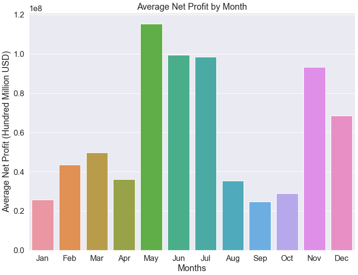
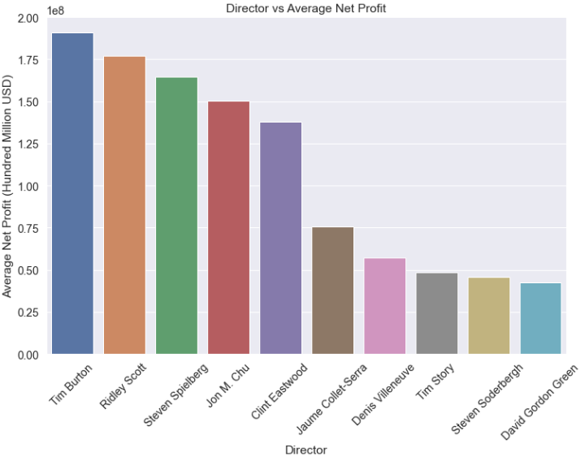
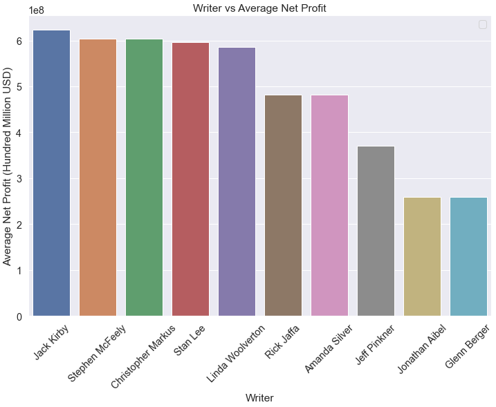

  <h1 align="center">Computing Vision's Quest for Greatness</h3>

  

    <h3 align='center'>Recommendations on how to create profitable content
     
    <a href="#overview">Overview</a>
    .
    <a href="#business-understanding">Business Understanding</a>
    .
    <a href="#data-understanding-and-analysis">Data Understanding and Analysis</a>
    .
    <a href="#statistical-communication">Statistical Communication</a>
    .
    <a href="#conclusion">Conclusion</a>
  

## Overview
For this project, you will use exploratory data analysis and statistical methods to generate insights for a business stakeholder.

## Business Understanding
A group of analysts were tasked with generating recommendations for Computing Vision (the stakeholder) which is a company that is looking to move into the content creation business. Different sources of data and different analysis techniques were used in generating these recommendations and with the use of these suggestions, Computing Vision should be able to produce content and films that have significant profit margins. 

## Data Understanding and Analysis
A myriad of different sources of data were used in the generation of the recommendations for the client. These sources include:
* IMDB
* The Movie Database
* Rotten Tomatoes
* Box Office Mojo
* The Numbers
<!-- end of list-->
Combining tables from each of the different sources, we were able to aggregate data that showed us key insights into what variables the client could manipulate in order to generate the most profitable movies. The analysis team would recommend the following in order for Computing Vision to make the most profit:
### Release Month
Based on the data below you can see that the summer months (May, June, and July) are the most profitable months to release a movie in.

### Director
There is a statistically significant disparity between the top 10 directors and the population of directors in the database.

### Writer
The 10 writers in our sample show a much higher average net profit as compared to the other writers in the population.

## Statistical Communication
In order to prove the validity of the conclusions we came to while exploring the data, we used statistical inferencing techniques such as the ANOVA test (Analysis of Variance) and the t-test. The ANOVA test describes the differences in sample mean across a categorical variable as compared to the population mean while the t-test describes the difference between an independent sample of the data and the population mean.

### Release Month
For the release month data that we aggregated, we performed the ANOVA test and it showed a p-value of 5e-50. This means that with an incredibly high confidence rate that there is a different between the average value of one of the categories and the population. Further analysis with a t-test determined that the month of May has a significantly different mean than the population, proving that it is a valid conclusion to release films in the month of May.

### Director and Writer
For the Director and Writer metrics, we were able to take a sample of the population (the top 10 directors/writers by average net profit) and compare the sample to the population. The t-test provided a p-value that concludes the sample mean is significantly higher than the population mean with at least 95% confidence.

## Conclusion
The problem that the team was presented with was discovering what factors the studio team could manipulate in order to maximize profits. Based on the results from our statistical inferences, we are able to conclude that the three variables `Release Month`, `Director`, and `Writer` are essential to ensuring box office success with concrete evidence. 